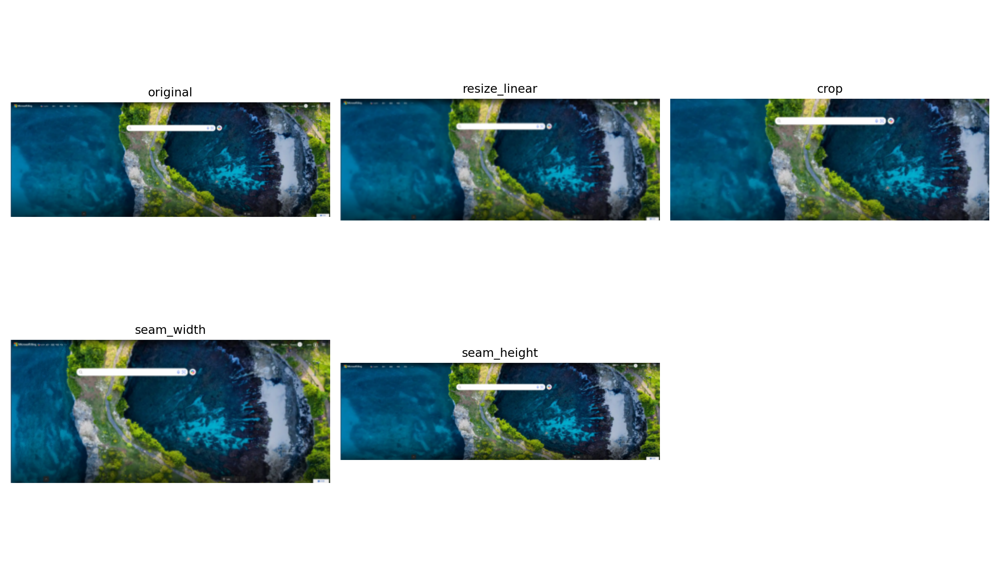
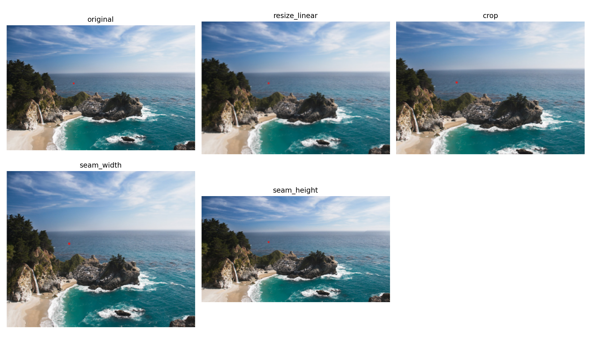

# hw1 op1 report draft

## 1. 问题背景
在实际图像缩放任务中，直接线性 resize 和直接 crop 往往难以同时满足“尺寸变化”和“主体信息保留”两个目标。线性 resize 会对整张图做均匀压缩，容易让主体产生形变；直接 crop 会直接截掉边缘区域，可能丢失关键语义信息。为了解决这一矛盾，本作业采用内容感知缩放（Seam Carving）：优先删除不重要的像素路径，从而在改变尺寸的同时尽量保留图像主要结构。

## 2. 算法原理
本实验的核心思想是 seam carving。首先为每个像素计算能量图 E，能量高通常表示边缘、纹理或结构显著区域，能量低通常表示较平坦区域。然后在能量图上寻找一条从上到下、相邻行列差不超过 1 的路径（vertical seam），目标是让该路径累计能量最小。该最小路径通过动态规划求解：
1. 逐行计算累计最小代价矩阵。
2. 记录每个位置的最优前驱列索引。
3. 在最后一行选最小值并回溯得到最优 seam。

删除该 seam 后，图像宽度减少 1。重复上述过程即可连续缩小图像宽度。对于高度缩小，可通过转置图像复用同一套 vertical seam 逻辑。

## 3. 实现方法
本次实现基于课程 Python 模板，在 [solutions/hw1_op1/reference_template/seam_carving.py](solutions/hw1_op1/reference_template/seam_carving.py) 中完成核心逻辑：
1. 能量计算：使用给定 Laplacian 风格卷积核按通道计算并累加，得到能量图。
2. 动态规划：构建累计代价矩阵与回溯指针矩阵，处理左右边界时做索引截断。
3. 回溯 seam：从最后一行最小代价位置向上回溯，得到连续 seam 路径。
4. 删除 seam：对每一行删除对应列像素，RGB 三通道同步删除。
5. 宽度缩小：重复“计算能量 -> 找 seam -> 删 seam”。
6. 高度缩小：图像转置后调用宽度缩小逻辑，再转置回原方向。

实现中增加了基本自检：seam 连续性检查、删除后维度检查，以及每次删除后重算能量图，避免常见实现错误。

## 4. 实验设计
实验使用两张测试图：
1. 主体明显图：bing1.png
2. 横向信息丰富图：original.png

目标尺寸设置为缩小场景（不做放大）：
1. 宽度缩小到约原始宽度的 80%。
2. 高度缩小到约原始高度的 85%。

对比方法共三类：
1. 普通线性缩放（resize_linear）
2. 直接中心裁剪（crop）
3. seam carving（分别测试 seam_width 与 seam_height）

对应结果图与汇总表已生成在：
1. [outputs/hw1_op1/case_subject_bing1](outputs/hw1_op1/case_subject_bing1)
2. [outputs/hw1_op1/case_landscape_original](outputs/hw1_op1/case_landscape_original)
3. [metrics/hw1_op1_metrics.csv](metrics/hw1_op1_metrics.csv)

## 5. 结果与分析
主体图对比：

横向场景图对比：

观察结论如下：
1. 相比线性 resize，seam carving 在多数区域对主体结构的保留更好，整体“被横向压扁”的感觉更弱。
2. 相比直接 crop，seam carving 能在不直接切掉整块边缘内容的前提下完成缩放，语义信息保留更完整。
3. seam carving 仍会引入局部伪影或纹理扭曲，尤其在高频纹理或规则结构密集区域更明显。
4. 从运行耗时看，seam carving 显著慢于 resize 和 crop，但作为基础版实现已可稳定得到可解释结果。

## 6. 局限与可能改进
当前实现是基础可运行版，仍有以下局限：
1. 只完成了缩小场景，尚未实现放大。
2. 速度优化尚未进行，纯 Python 循环在较大图像上耗时较长。
3. 能量函数仍为基础版本，未引入更复杂或更鲁棒的能量设计。

后续可从三条路径改进：支持放大、向量化/并行优化、尝试梯度或语义引导能量函数。
